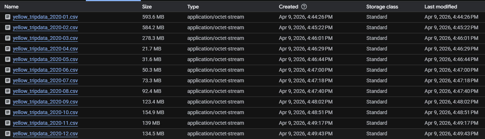
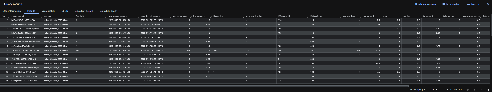
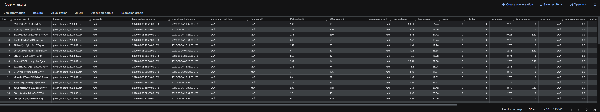
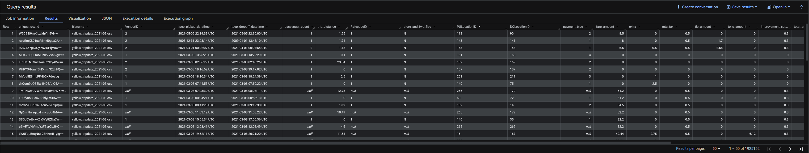

### Quiz Questions

Complete the quiz shown below. It's a set of 6 multiple-choice questions to test your understanding of workflow orchestration, Kestra, and ETL pipelines.

1. Within the execution for `Yellow` Taxi data for the year `2020` and month `12`: what is the uncompressed file size (i.e. the output file `yellow_tripdata_2020-12.csv` of the `extract` task)?

- 134.5 MiB

Screenshot from the bucket where I'm uploading the CSV files:


2. What is the rendered value of the variable `file` when the inputs `taxi` is set to `green`, `year` is set to `2020`, and `month` is set to `04` during execution?

- `green_tripdata_2020-04.csv`

3. How many rows are there for the `Yellow` Taxi data for all CSV files in the year 2020?

- 24,648,499

```sql
SELECT *
FROM `data_engineering_zoomcamp.yellow_tripdata` ytd
WHERE ytd.filename LIKE 'yellow_tripdata_2020%';
```



4. How many rows are there for the `Green` Taxi data for all CSV files in the year 2020?

- 1,734,051

```sql
SELECT *
FROM `data_engineering_zoomcamp.green_tripdata` gtd
WHERE gtd.filename LIKE 'green_tripdata_2020%';
```



5. How many rows are there for the `Yellow` Taxi data for the March 2021 CSV file?

- 1,925,152

```sql
SELECT *
FROM `data_engineering_zoomcamp.yellow_tripdata` ytd
WHERE ytd.filename = 'yellow_tripdata_2021-03.csv';
```



6. How would you configure the timezone to New York in a Schedule trigger?

- Add a `timezone` property set to `America/New_York` in the `Schedule` trigger configuration

The final result would be:

```yaml
triggers:
  - id: green_schedule
    type: io.kestra.plugin.core.trigger.Schedule
    cron: "0 9 1 * *"
    timezone: America/New_York
    inputs:
      taxi: green

  - id: yellow_schedule
    type: io.kestra.plugin.core.trigger.Schedule
    cron: "0 10 1 * *"
    timezone: America/New_York
    inputs:
      taxi: yellow
```
