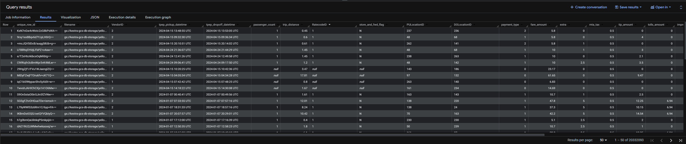
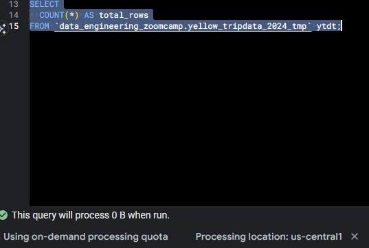
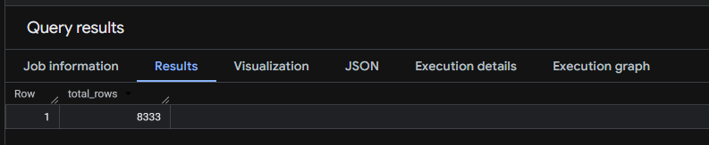
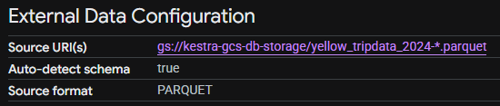
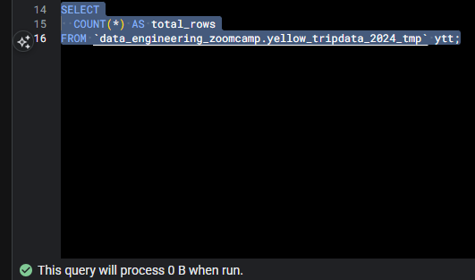

# Module 3 Homework: Data Warehousing & BigQuery

## Question 1. Counting records

What is count of records for the 2024 Yellow Taxi Data?

- 20,332,093

```sql
SELECT *
FROM `data_engineering_zoomcamp.yellow_tripdata` ytd
WHERE ytd.filename in
(
'gs://kestra-gcs-db-storage/yellow_tripdata_2024-01.parquet',
'gs://kestra-gcs-db-storage/yellow_tripdata_2024-02.parquet',
'gs://kestra-gcs-db-storage/yellow_tripdata_2024-03.parquet',
'gs://kestra-gcs-db-storage/yellow_tripdata_2024-04.parquet',
'gs://kestra-gcs-db-storage/yellow_tripdata_2024-05.parquet',
'gs://kestra-gcs-db-storage/yellow_tripdata_2024-06.parquet'
);
```



## Question 2. Data read estimation

Write a query to count the distinct number of PULocationIDs for the entire dataset on both the tables.

What is the **estimated amount** of data that will be read when this query is executed on the External Table and the Table?

- 0 MB for the External Table and 0MB for the Materialized Table

```sql
SELECT
  COUNT(*) AS total_rows
FROM `data_engineering_zoomcamp.yellow_tripdata_2024_ext` ytde;


SELECT
  COUNT(*) AS total_rows
FROM `data_engineering_zoomcamp.yellow_tripdata_2024_tmp` ytdt;
```



## Question 3. Understanding columnar storage

Write a query to retrieve the PULocationID from the table (not the external table) in BigQuery. Now write a query to retrieve the PULocationID and DOLocationID on the same table.

Why are the estimated number of Bytes different?

- BigQuery is a columnar database, and it only scans the specific columns requested in the query. Querying two columns (PULocationID, DOLocationID) requires
  reading more data than querying one column (PULocationID), leading to a higher estimated number of bytes processed.

## Question 4. Counting zero fare trips

How many records have a fare_amount of 0?

- 8,333

```sql
SELECT
COUNT(*) AS total_rows
FROM `data_engineering_zoomcamp.yellow_tripdata_2024_tmp` ytdt
WHERE ytdt.filename IN
(
'gs://kestra-gcs-db-storage/yellow_tripdata_2024-01.parquet',
'gs://kestra-gcs-db-storage/yellow_tripdata_2024-02.parquet',
'gs://kestra-gcs-db-storage/yellow_tripdata_2024-03.parquet',
'gs://kestra-gcs-db-storage/yellow_tripdata_2024-04.parquet',
'gs://kestra-gcs-db-storage/yellow_tripdata_2024-05.parquet',
'gs://kestra-gcs-db-storage/yellow_tripdata_2024-06.parquet'
)
AND ytdt.fare_amount = 0;
```



## Question 5. Partitioning and clustering

What is the best strategy to make an optimized table in Big Query if your query will always filter based on tpep_dropoff_datetime and order the results by VendorID (Create a new table with this strategy)

- Partition by tpep_dropoff_datetime and Cluster on VendorID

## Question 6. Partition benefits

Write a query to retrieve the distinct VendorIDs between tpep_dropoff_datetime
2024-03-01 and 2024-03-15 (inclusive)

Use the materialized table you created earlier in your from clause and note the estimated bytes. Now change the table in the from clause to the partitioned table you created for question 5 and note the estimated bytes processed. What are these values?

Choose the answer which most closely matches.

- 310.24 MB for non-partitioned table and 26.84 MB for the partitioned table

```sql
SELECT
DISTINCT
  ytp.VendorID
FROM `data_engineering_zoomcamp.yellow_tripdata_2024_partitioned` ytp
WHERE DATE(ytp.tpep_dropoff_datetime) BETWEEN '2024-03-01' AND '2024-03-15';


SELECT
DISTINCT
  ytwp.VendorID
FROM `data_engineering_zoomcamp.yellow_tripdata_2024_without_partition` ytwp
WHERE DATE(ytwp.tpep_dropoff_datetime) BETWEEN '2024-03-01' AND '2024-03-15';
```

## Question 7. External table storage

Where is the data stored in the External Table you created?

- GCP Bucket



## Question 8. Clustering best practices

It is best practice in Big Query to always cluster your data:

- False

## Question 9. Understanding table scans

No Points: Write a `SELECT count(*)` query FROM the materialized table you created. How many bytes does it estimate will be read? Why?

It will process 0B, as we can see in the print below. This happens because the table's metadata is stored separately from the data inside the table, so without a `WHERE` clause, it would retrieve this information directly from the table metadata, skipping the need to process data.


