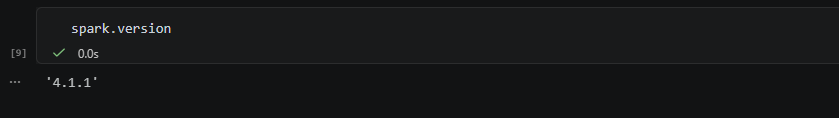
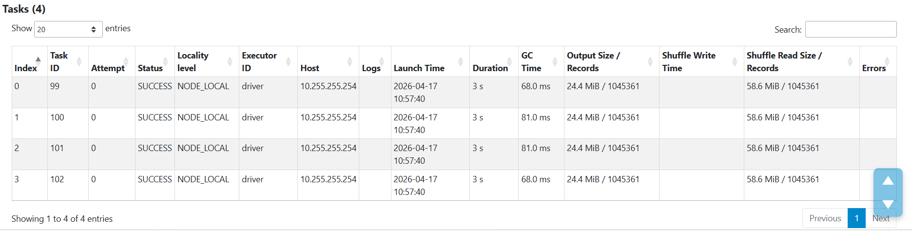
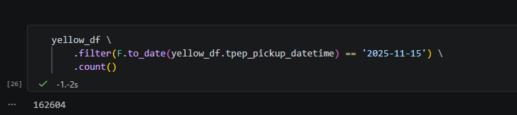
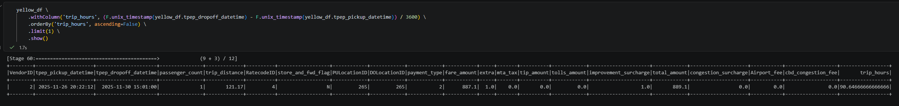
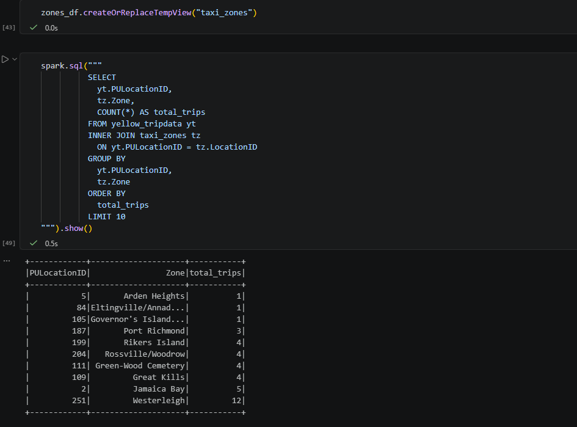

## Question 1: Install Spark and PySpark

- Install Spark
- Run PySpark
- Create a local spark session
- Execute spark.version.

What's the output?

- It shows the Spark version installed in my virtual environment: '4.1.1'
  

## Question 2: Yellow November 2025

Read the November 2025 Yellow into a Spark Dataframe.

Repartition the Dataframe to 4 partitions and save it to parquet.

What is the average size of the Parquet (ending with .parquet extension) Files that were created (in MB)? Select the answer which most closely matches.

- 25MB



## Question 3: Count records

How many taxi trips were there on the 15th of November?

Consider only trips that started on the 15th of November.

- 162,604



## Question 4: Longest trip

What is the length of the longest trip in the dataset in hours?

- 90.6



## Question 5: User Interface

Spark's User Interface which shows the application's dashboard runs on which local port?

- 4040

## Question 6: Least frequent pickup location zone

Load the zone lookup data into a temp view in Spark:

```bash
wget https://d37ci6vzurychx.cloudfront.net/misc/taxi_zone_lookup.csv
```

Using the zone lookup data and the Yellow November 2025 data, what is the name of the LEAST frequent pickup location Zone?

- Governor's Island/Ellis Island/Liberty Island
- Arden Heights


